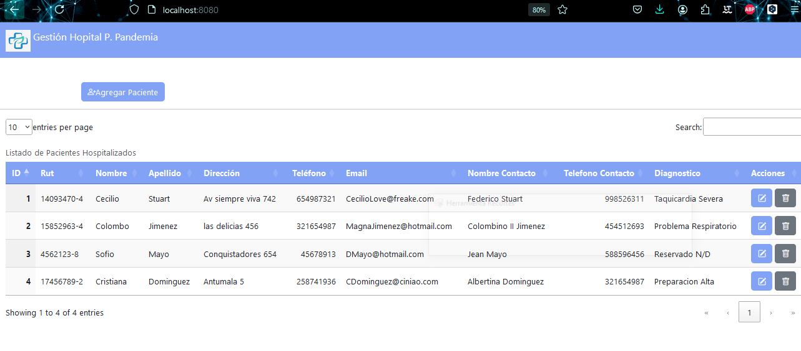
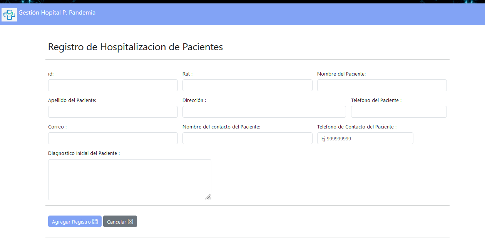
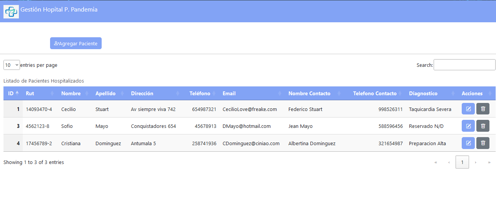
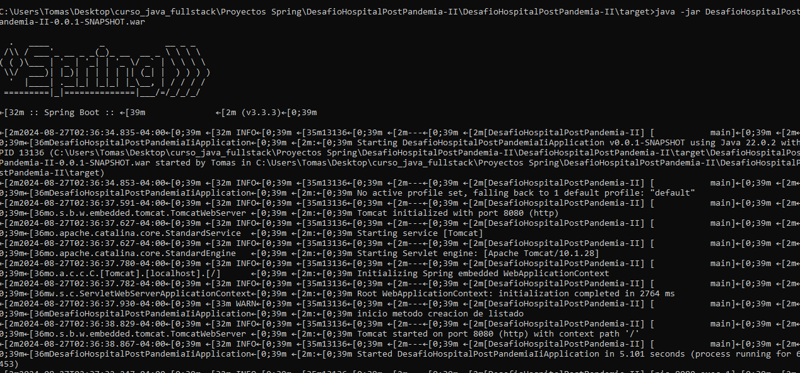
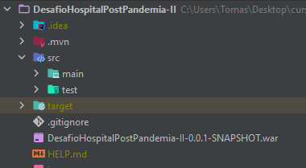

Desafío -Pacientes Clínica post Pandemia
--
En este desafío validaremos nuestros conocimientos de creación de proyectos web Spring
Boot. Para lograrlo, necesitarás aplicar todo lo aprendido en esta unidad.

Lee todo el documento antes de comenzar el desarrollo individual de este desafío, para
asegurarte de tener el máximo de puntaje y enfocar bien los esfuerzos. Una vez terminado el
desafío, comprime la carpeta que contiene el desarrollo de los requerimientos solicitados y
sube el .zip en el LMS.

Descripción
--
<b>Proyecto Clínica post pandemia.</B>

Tras el paso del coronavirus a nivel nacional, se levantó la necesidad de tener un registro en
el sistema de todos los pacientes hospitalizados. Por ello, la empresa de software está
solicitando nuevamente sus servicios para crear un software, con el objetivo de
implementarlo en las clínicas de todo el país.

Por tanto, deberás de mostrar un aplicativo web Spring Boot donde en el sistema muestre el
listado de los pacientes que se encuentran hospitalizados. El plus más importante de este
aplicativo es saber mostrar los conocimientos previos sobre el uso de las anotaciones
service, controller, Repository, conexión de base de datos, y la vista.

Para este desafío necesitamos que retorne en pantalla una lista de pacientes levantando tu
aplicación web Spring boot, donde puedas realizar operaciones de tipo CRUD en el aplicativo.

Requerimientos
--

Mediante la utilización del IDE de desarrollo Eclipse, se debe crear un nuevo proyecto Web
Spring Boot llamado “ClinicaPostPandemia”.

1. Crear un nuevo proyecto Web Spring Boot que contenga las anotaciones
   correspondientes, el uso del logger al momento de listar pacientes y las inyecciones
   de dependencias. (2 Puntos)
2. Implementar el uso de modelos, controladores y servicios en sus respectivos package
   e Implementar redirección a la vista JSP . (2 Puntos)
3. Retornar en pantalla en JSP o thymeleaf, la lista de los pacientes listados en una tabla.
   (2 Puntos)
4. Realizar operaciones tipo CRUD para los pacientes. (2 Puntos)
5. Generar war de la aplicación.(2 Puntos)

 ¡Mucho éxito!

   Consideraciones y recomendaciones
   Te puedes apoyar de los ejercicios vistos en unidades anteriores a modo de consulta.
   

Imagenes del proyecto Realizado 

